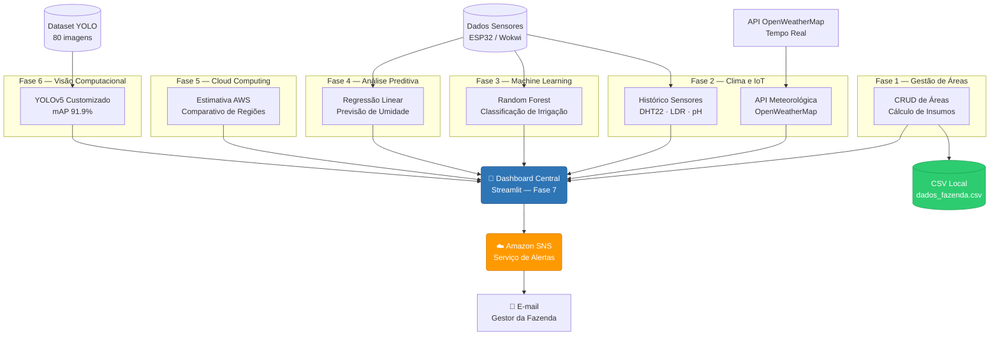
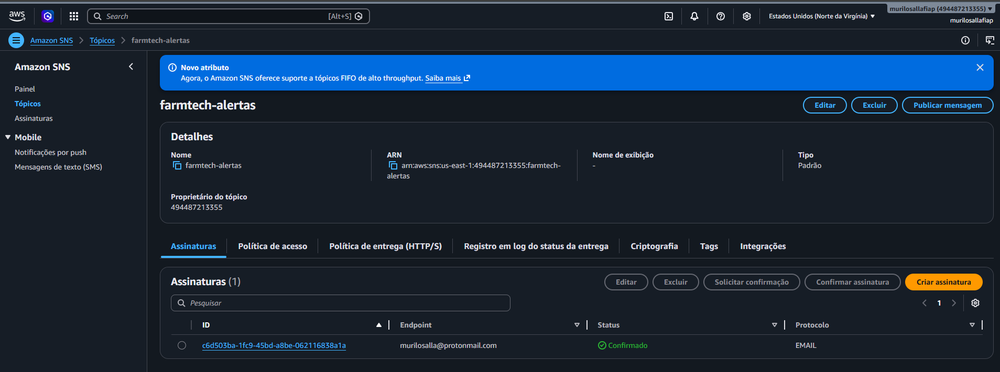
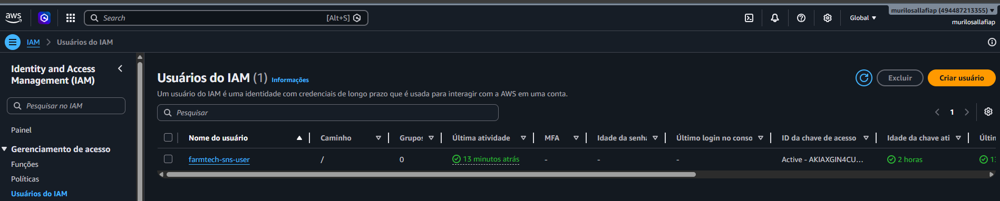
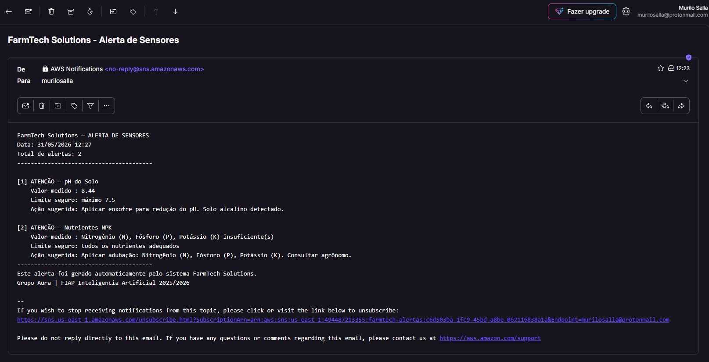
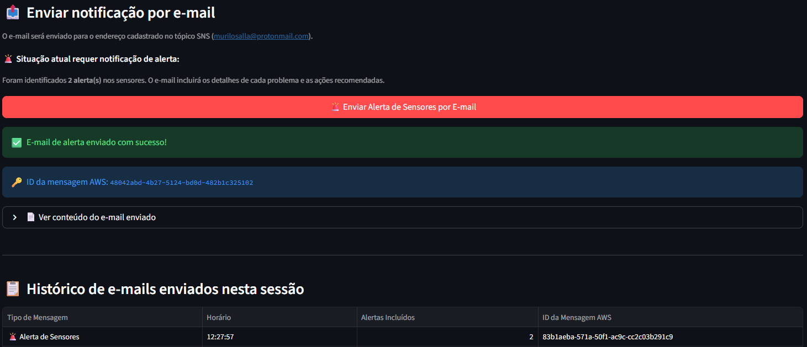

# FIAP - Faculdade de Informática e Administração Paulista

<p align="center">
<a href="https://www.fiap.com.br/"></a>
</p>

<br>

# Fase 7 | Cap 1 – A Consolidação de um Sistema

## Grupo Aura

## 👨‍🎓 Integrantes:
- <a href="https://www.linkedin.com/in/murilosalla">Murilo Salla</a> – RM568041
- <a href="#">Elias da Silva de Souza</a> – RM568500
- <a href="#">Julia Duarte de Carvalho</a> – RM567816

## 👩‍🏫 Professores:
### Tutor(a)
- <a href="#">Ana Cristina dos Santos</a>
### Coordenador(a)
- <a href="#">André Godoi Chiovato</a>

---

## 🎬 Vídeo Demonstrativo

> ▶️ **[Assista no YouTube — LINK A SER INSERIDO APÓS GRAVAÇÃO]()** *(não listado)*

---

## 📜 Descrição

A **Fase 7** representa a consolidação de todo o ecossistema digital da **FarmTech Solutions**, integrando os serviços desenvolvidos ao longo das Fases 1 a 6 em um único sistema de gestão agrícola inteligente.

O projeto une:
- **Cálculo de insumos e gestão de áreas** (Fase 1)
- **Monitoramento meteorológico via API + sensores IoT ESP32** (Fase 2)
- **IoT com ESP32 e classificação de irrigação com ML** (Fase 3)
- **Dashboard analítico com regressão preditiva de umidade** (Fase 4)
- **Infraestrutura AWS e estimativa de custos em nuvem** (Fase 5)
- **Serviço de alertas via AWS SNS** (Fase 7)
- **Visão computacional com YOLOv5 customizado** (Fase 6)

Tudo orquestrado por um único **dashboard Streamlit** que permite ao gestor agrícola acessar cada módulo por meio de abas interativas, com botões de disparo para cada serviço.

---

## 🏗️ Arquitetura da Solução



---

## 📁 Estrutura de pastas

```
grupoaura-fase7-cap1/
├── .github/
│   └── problem-report.md
├── assets/
│   ├── logo-fiap.png
│   └── aws/                                  # Prints da configuração AWS SNS
│       ├── 01-topico-sns-assinatura.png
│       ├── 02-usuario-iam.png
│       ├── 03-email-alerta-recebido.png
│       └── 04-dashboard-alerta-sucesso.png
├── config/
│   ├── .env.example                          # Modelo de variáveis de ambiente
│   └── readme.md
├── data/
│   ├── fase2_sensores_20251025_084829.csv    # Dados dos sensores IoT (ESP32/Wokwi)
│   └── dados_fazenda.csv                     # Áreas de plantio cadastradas
├── document/
│   ├── ai_project_document_fiap.md
│   └── other/
├── scripts/
│   ├── setup_venv.ps1                        # Cria e configura o ambiente virtual
│   └── run_dashboard.ps1                     # Inicia o dashboard
├── src/
│   ├── fase1/
│   │   └── main.py                           # CRUD de áreas e cálculo de insumos
│   ├── fase2/
│   │   └── openweather.py                    # Consulta API meteorológica
│   ├── fase3/
│   │   ├── ml_irrigacao.py                   # Classificador Random Forest de irrigação
│   │   └── model_irrigacao.pkl               # Modelo treinado (gerado em runtime)
│   ├── fase4/
│   │   ├── pipeline_regressao.py             # Pipeline de regressão de umidade
│   │   └── model_regressao_umidade.pkl       # Modelo de regressão treinado
│   ├── fase6/
│   │   ├── yolo_detector.py                  # Inferência YOLOv5 (Garrafa / Celular)
│   │   ├── best.pt                           # Pesos do modelo treinado (mAP 90.3%)
│   │   ├── treinar_yolo.py                   # Script de re-treinamento local
│   │   └── dataset/                          # Dataset com 80 imagens anotadas
│   ├── aws/
│   │   └── sns_alert.py                      # Serviço de alertas AWS SNS
│   └── dashboard.py                          # Dashboard central Streamlit
├── requirements.txt
└── README.md
```

---

## 🔧 Como executar o projeto

### Pré-requisitos

| Ferramenta | Versão mínima | Link |
|-----------|--------------|------|
| Python    | 3.10+        | [python.org](https://python.org) |
| Git       | qualquer     | [git-scm.com](https://git-scm.com) |
| VSCode    | qualquer     | [code.visualstudio.com](https://code.visualstudio.com) |

### 1. Clonar o repositório

```bash
git clone https://github.com/murilosalla-blip/grupoaura-fase7-cap1.git
cd grupoaura-fase7-cap1
```

### 2. Configurar ambiente virtual

**Windows (PowerShell):**
```powershell
.\scripts\setup_venv.ps1
```

**Manual:**
```bash
python -m venv .venv
.venv\Scripts\activate        # Windows
# ou
source .venv/bin/activate     # Linux/Mac

pip install -r requirements.txt
```

### 3. Configurar variáveis de ambiente

```bash
cp config/.env.example config/.env
```

Edite o arquivo `config/.env` com suas credenciais:

```env
OPENWEATHER_API_KEY=sua_chave_aqui
AWS_ACCESS_KEY_ID=sua_access_key_aqui
AWS_SECRET_ACCESS_KEY=sua_secret_key_aqui
AWS_REGION=us-east-1
SNS_TOPIC_ARN=arn:aws:sns:us-east-1:ACCOUNT_ID:farmtech-alertas
```

> O sistema funciona sem as chaves — nesse caso usa dados simulados para clima e modo demonstração para os alertas AWS.

### 4. (Opcional) Re-treinar o modelo YOLO — Fase 6

O modelo YOLOv5 foi treinado localmente com CPU. Para re-treinar:

```bash
python src/fase6/treinar_yolo.py
```

O script clona o YOLOv5, prepara o dataset (80 imagens) e gera o `best.pt` automaticamente.

### 5. Iniciar o dashboard

**Windows (PowerShell):**
```powershell
.\scripts\run_dashboard.ps1
```

**Manual:**
```bash
streamlit run src/dashboard.py
```

Acesse em: **http://localhost:8501**

---

## 🧭 Guia de funcionalidades por aba

| Aba | Fase | O que faz |
|-----|------|-----------|
| 🌾 Fase 1 — Áreas | Fase 1 | Cadastra, lista e remove áreas de plantio com cálculo automático de insumos (NPK / Herbicida) |
| 🌤️ Fase 2 — Clima & IoT | Fase 2 | Dados meteorológicos em tempo real via API + histórico dos sensores IoT (DHT22, LDR, pH) |
| 🤖 Fase 3 — Irrigação ML | Fase 3 | Modelo Random Forest que prevê se irrigação deve ser ligada ou desligada com base nos sensores |
| 📈 Fase 4 — Análise Preditiva | Fase 4 | Análise exploratória dos dados e simulador what-if para prever umidade do solo |
| ☁️ Fase 5 — Cloud AWS | Fase 5 | Estimativa de custos AWS e comparativo entre regiões (us-east-1 vs sa-east-1) |
| 👁️ Fase 6 — Visão Computacional | Fase 6 | Detecção de objetos (Garrafa/Celular) com YOLOv5 customizado — mAP 90.3% |
| 🚨 AWS SNS — Alertas | Fases 5+7 | Monitora sensores e dispara alertas por e-mail via Amazon SNS quando limites são ultrapassados |

---

## ☁️ Configuração AWS SNS (Alertas)

O serviço de alertas utiliza o **Amazon Simple Notification Service (SNS)** da AWS, integrado ao dashboard para monitorar os sensores IoT e notificar o gestor da fazenda por **e-mail** quando valores críticos são detectados.

---

### 📸 Evidências da configuração AWS

**1. Tópico SNS criado e assinatura de e-mail confirmada**

> Tópico `farmtech-alertas` criado na região `us-east-1` (Virgínia do Norte).
> E-mail `murilosalla@protonmail.com` cadastrado como assinante com status **Confirmado**.



---

**2. Usuário IAM com permissão SNS**

> Usuário `farmtech-sns-user` criado no IAM com a política `AmazonSNSFullAccess`,
> permitindo que o dashboard Python publique mensagens no tópico via `boto3`.



---

**3. E-mail de alerta recebido**

> E-mail enviado automaticamente pelo sistema FarmTech Solutions via AWS SNS,
> contendo os alertas identificados nos sensores IoT (pH do Solo e Nutrientes NPK)
> com as respectivas ações corretivas recomendadas.



---

**4. Dashboard com alerta disparado com sucesso**

> Confirmação do envio no dashboard Streamlit, exibindo o `Message ID` gerado pela AWS
> e o histórico de mensagens enviadas na sessão.



---

### O que dispara um alerta:

| Sensor | Limiar mínimo | Limiar máximo | Ação sugerida |
|--------|--------------|--------------|---------------|
| Umidade do solo | 30% | 80% | Irrigar / Reduzir irrigação |
| Temperatura | 10°C | 40°C | Ajustar manejo |
| pH do solo | 5.5 | 7.5 | Aplicar calcário / enxofre |
| Nutrientes NPK | — | — | Adubação dirigida |

### Como configurar:

1. Acesse [AWS Console](https://console.aws.amazon.com) e crie uma conta (Free Tier)
2. Navegue até **SNS → Tópicos → Criar tópico** (tipo: Padrão), nome: `farmtech-alertas`
3. Crie uma **Assinatura** com protocolo E-mail e confirme no e-mail recebido
4. Em **IAM**, crie um usuário com a política `AmazonSNSFullAccess` e gere as chaves de acesso
5. Preencha o arquivo `config/.env` com as credenciais e o ARN do tópico

---

## 🗃 Histórico de lançamentos

* **1.0.0 — 10/06/2026**
  * Entrega oficial da Fase 7 — Consolidação do Sistema
  * Dashboard Streamlit com integração das Fases 1 a 6
  * Serviço de alertas AWS SNS implementado
  * Documentação completa e vídeo demonstrativo

---

## 📋 Licença

<p xmlns:cc="http://creativecommons.org/ns#" xmlns:dct="http://purl.org/dc/terms/"><a property="dct:title" rel="cc:attributionURL" href="https://github.com/agodoi/template">MODELO GIT FIAP</a> por <a rel="cc:attributionURL dct:creator" property="cc:attributionName" href="https://fiap.com.br">Fiap</a> está licenciado sobre <a href="http://creativecommons.org/licenses/by/4.0/?ref=chooser-v1" target="_blank" rel="license noopener noreferrer">Attribution 4.0 International</a>.</p>
